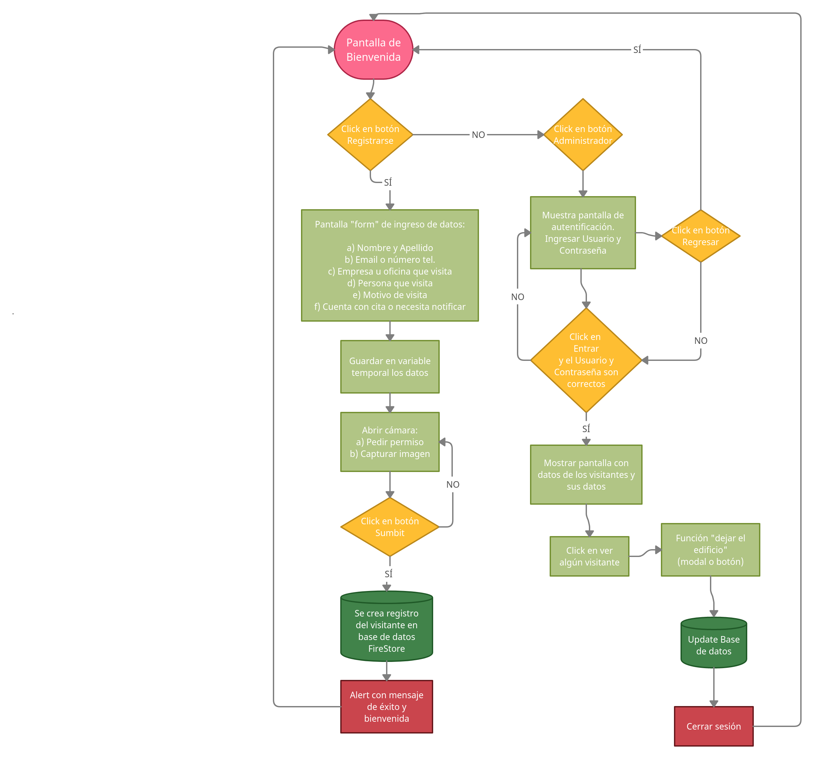
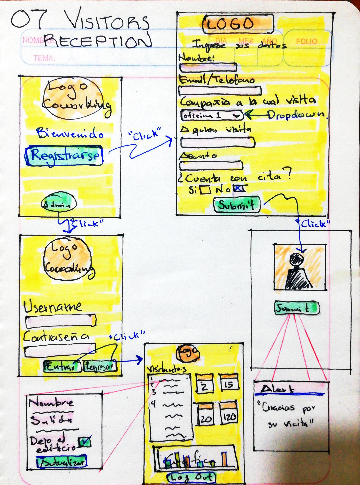
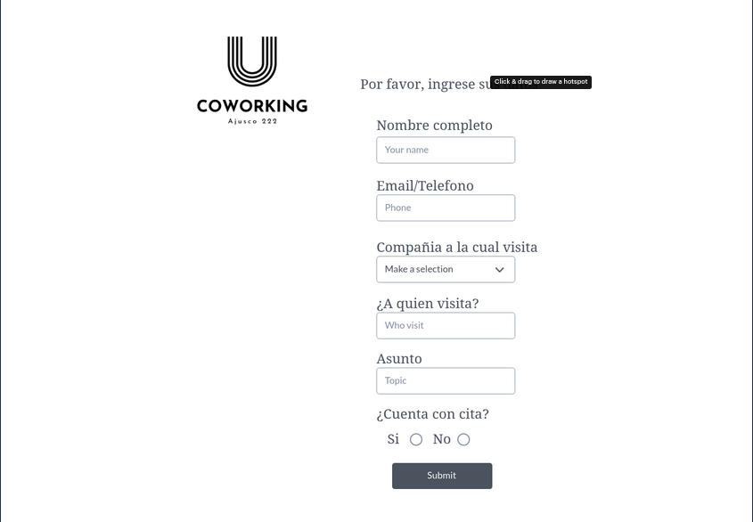
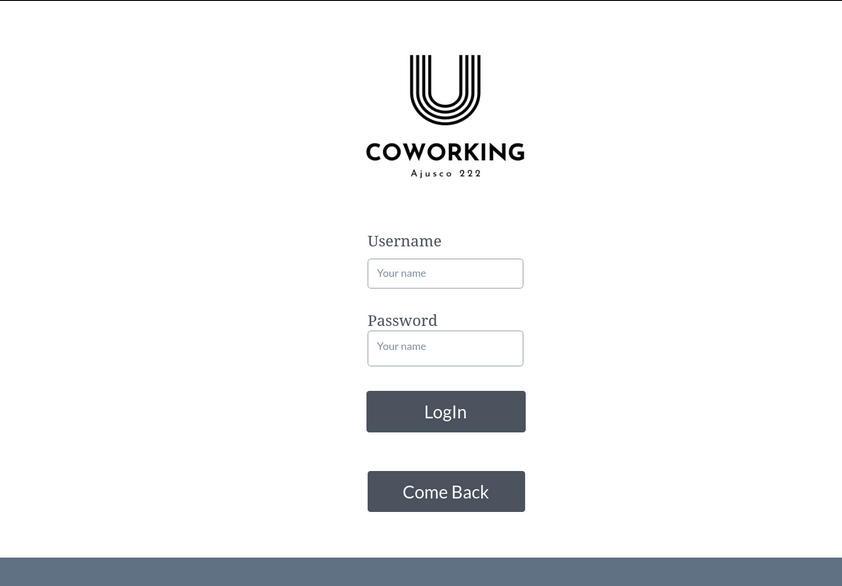
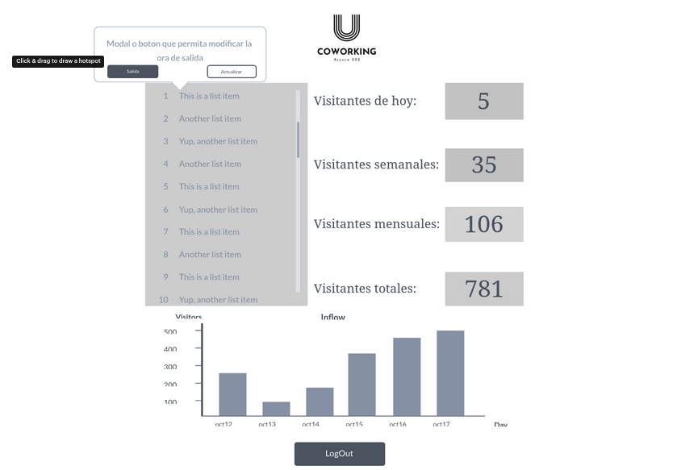

# 07_Visitors_Reception

_Coworking Ajusco 222_ es un icónico edificio al sur de la Ciudad de México el cual reúne las sedes en México de las empresas más importantes del mundo: Apple, Amazon, Cisco, IBM, Google, Microsoft, Tesla, SpaceX...

Por ello, el control de aflujo (entrada/salida) y la seguridad demandan especial atención. Tratándose de un edificio 100% tecnológico, esta app da respuesta al check-in / check-out de una forma ágil, eficiente, limpia y segura.

Especialmente en un mundo que enfrenta una crisis sanitaria, esta APP VisitorsCheck da respuesta a nuestras necesidades del futuro

---


---

Índice

    1. Definición de usuario
    2. Historias de usuario
    3. Conocimientos técnicos
    4. Boilerplate
    5. Diagrama de flujo
    6. Prototipado
    7. Producto final

---

## 1. Definición de usuario

Esta aplicación sirve a dos tipos de usuarios vinculados a un mismo problema: el control de aflujo en un edificio de trabajo.

**Usuario 1: Visitantes del edificio de coworking**

**Usuario 2: Administradores de recepción del edificio de coworking**

## 2. Historias de usuario:

La interfaz permite a los visitantes:

- Para quienes desean acceder al edificio, deben poder registrar:

  - Nombre y apellido
  - Correo electrónico o número de teléfono
  - Empresa u oficina que visita
  - Personas que visitan
  - Razón para visitar
  - Si ya tenía cita o necesita notificar a la oficina que visita
  - Después de que se capturaron estos datos, podrá tomar una foto del rostro del visitante.
  - Almacene todo el registro y confirme que el registro se ha realizado correctamente y se permite la entrada al visitante.

---

- Para los administradores del edificio de coworking (esta parte no es visible como primera vista para los visitantes):

  - Mostrar una vista privada con contraseña de acceso
  - Mostrar la lista de visitantes completa ordenados por fecha de registro
  - Mostrar cuántos visitantes se han registrado hasta ahora.
  - Mostrar cuántos visitantes se han registrado durante los últimos 30 días.
  - Mostrar cuántos visitantes se han registrado durante la última semana (7 días)
  - Mostrar cuántos visitantes se han registrado durante el día.
  - Poder añadir una marca de los visitantes que han abandonado el edificio como "Fecha de salida" y la fecha de salida.

## 3. Conocimientos técnicos

- Uso de JavaScript Vanilla ES6 (ECMAScript 2015 y superior), HTML5, CSS3

- `npm init` & `eslintrc.json`

- JSON

- ASYNC AWAIT

- DB Firestore

- CRUD en Firebase

- Data Structuring

- Acceso al sistema operativo: cámara

- Métodos Array e iteraciones

- Iteración de objetos y buscadores de key

- Importación y exportación de módulos

- .gitignore

- Modelado de ramas development & release

- Aplicación responsiva (tabletas & desktops)

- Documentación del SDLC ágil en ReadMe.md. Planificación de Backlog

- Bootstrap Framework

- Persistencia de los datos. Almacenar los datos en la base de datos de Firestore.

- Leer los datos de la base de datos para mostrarlos en la vista de administradores.

## 4. _Boilerplate_

```text
./
├── .editorconfig
├── .eslintrc
├── .gitignore
├── README.md
├── package.json
├── assets
├── src
│   ├── app.js
│   ├── data.js
│   ├── index.html
│   ├── index.js
│   ├── style.css
│   ├── visitors.html
│   ├── visitors.js
│   ├── admin.js
|   ├── admin.html
│   └── administration.js
└── test
    ├── app.spec.js
    └── index.html
```

## 5. Diagrama de flujo




---

## 6. Prototipado

## 







## 7. Producto final
